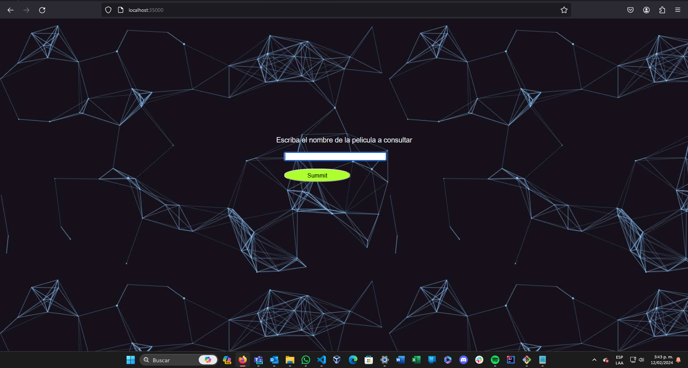
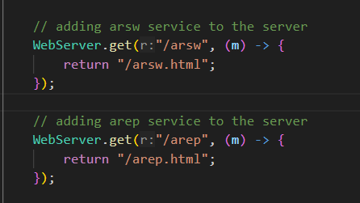
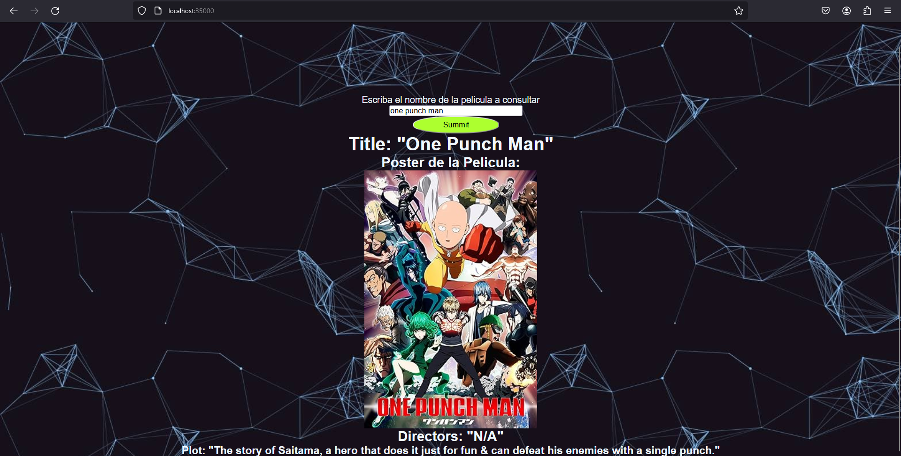
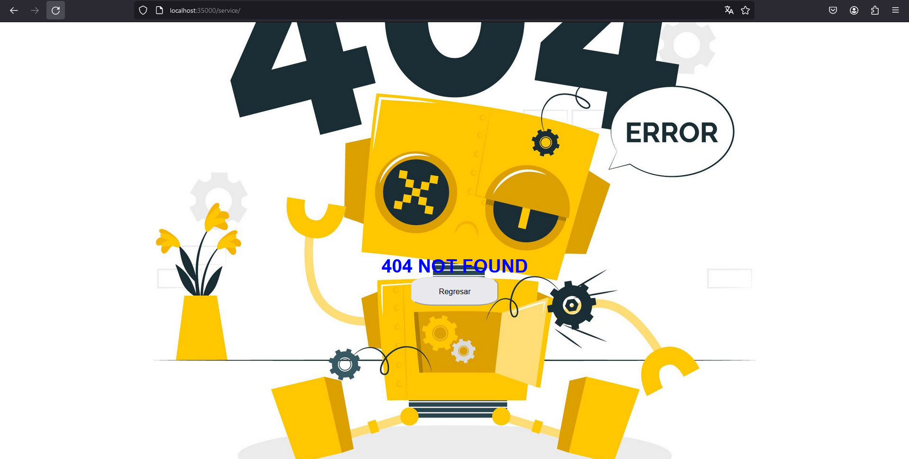
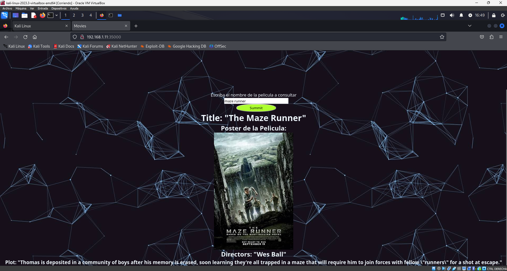
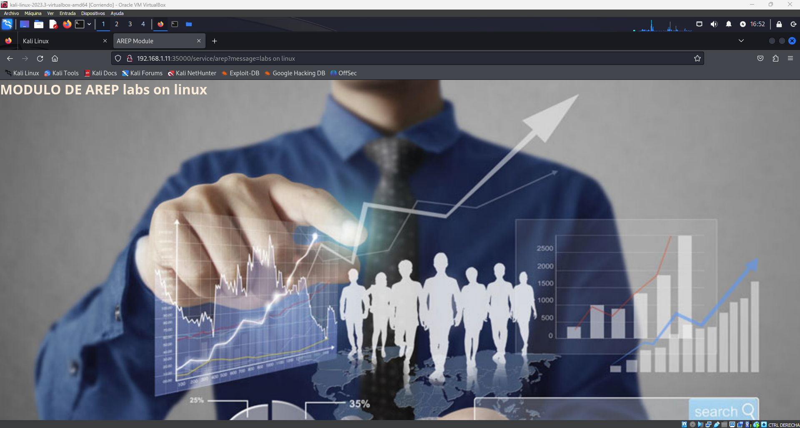
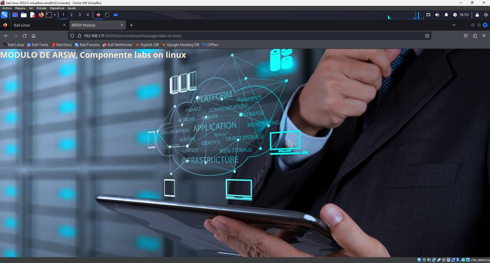

# TALLER #3, MICROFRAMEWORK WEB

En este trabajo, se implementara un microframework web, un poco similar a spark, usando el trabajo realizado para la consulta de peliculas usando un servidor fachada

## PARA EMPEZAR

Se debe contar con un Sistema Operativo capaz de correr un IDE para poder realizar la ejecución el aplicativo, pues este cuenta con los siguientes componentes:
* [Java version 17](https://www.oracle.com/co/java/technologies/downloads/) - Lenguaje de programación usado.
* [Maven](https://maven.apache.org/download.cgi) - Gestor de dependencias del proyecto
* [Git](https://git-scm.com/downloads) - Gestion de versiones del proyecto 

### PREREQUISITOS

1. Contar con IDE para la ejecución del proyecto
2. Contar con las herramientas mencionadas anteriormente
3. Al tenerlas, ejecutar el siguiente comando en la maquina

```bash
git clone https://github.com/santiforero1018/TALLER3-AREP.git
```

### JAVADOC
Usando el siguiente comando: 
```
mvn site
```
se genera la documentación del proyecto, aunque ya se encuentra generada. Para acceder a ella, se encuentra en la carpeta targe/site en el archivo index.html


### DESCRIPCION DEL PROYECTO

Al tratar de acceder al servicio por medio de la siguiente URL:

´
http://localhost:35000/
´

se vera el siguiente front retornado por el servidor:



Ahora, a la plataforma montada con java, se le puede solicitar cualquier servicio almacenado, para acceder a diferentes modulos.


## INICIANDO EL PROYECTO

```
1. En un IDE de desarrollo, se ejecuta la clase Main.java, lo mas recomendable es usar Visual Studio Code y las extensiones para java y ejecutarla
2. En un browser, ingresar a la URL http://localhost:35000
3. En la barra de busqueda, insertar el nombre de la pelicula a buscar
```

Si desea hacerlo usando la linea de comandos, use los siguientes:
```
mvn clean compile
mvn exec:java
```

con estos comandos, se vuelve a compilar el codigo y lo pone en ejecución, recuerde entrar en la carpeta .\taller3 para empezar a ejecutar.

Inicialmente, el aplicativo iniciara con los servicios mostrados en la siguiente Imagen




## PRUEBAS 

1. Cuando se usa la URL `http://localhost:35000`, se realizan las siguientes peticiones al servidor

- `/client.html`
- `/IMG/imagen1.jpg`
- `/design/client.css`
- `/Js/client.js`

y mostrará la siguiente pagina:


2. Cuando se realiza una petición para solicitar los datos de una pelicula, se realiza la siguiente petición
   - `/movieInfo.html`

  y saldra la información general de la pelicula 
   

Las anteriores pruebas muestran como se retorna la primera parte para la consulta de peliculas. A continuación, se muestra como acceder a los diferentes servicios usando el path `/service`

1. Cuando se busca un servicio incorrecto, o no se completa correctamente el path
   - petición de `/NotFound.html`
   - petición de `/design/notFound.css`
   - petición de `/IMG/5203299.jpg`

    
     
3. Cuando se entra al servicio de `/service/arep`
   - petición de `/arep.html`
   - petición de `/design/arep.css`
   - petición de `/IMG/arep.jpg`

   

     
4. Cuando se entra al servicio de `/service/arep?message=labs`
   - petición de `/arep.html`
   - petición de `/design/arep.css`
   - petición de `/IMG/arep.jpg`

   
     
5. Cuando se entra al servicio de `/service/arsw`
   - petición de `/arsw.html`
   - petición de `/design/arsw.css`
   - petición de `/IMG/ARSW.jpg`

   
     
6. Cuando se entra al servicio de `/service/arsw?message=teorico`
   - petición de `/arsw.html`
   - petición de `/design/arsw.css`
   - petición de `/IMG/ARSW.jpg`

   
  

Si desea ensayar otros mensajes a mostras en la pantalla de los servicios respectivos, puede usar la siguiente url:

`/service/{servicio}?message={mensaje}`

### Pruebas con Linux

Las mismas pruebas realizadas anteriormente se realizaron con el SO de Windows 11, ahora se haran usando una maquina virtual de Kali Linux

1. Pagina principal de la consulta de peliculas

   
   
2. Pagina al consultar un servicio no existente o sin completar la ruta

   
   .png)
   
4. Pagina al consultar el servicio de AREP

   
   
5. Pagina al consultar el servicio de ARSW

   

## DESARROLLADO CON

* [Java version 17](https://www.oracle.com/co/java/technologies/downloads/) - Lenguaje de programación usado.
* [Maven](https://maven.apache.org/download.cgi) - Gestor de dependencias del proyecto
* [Git](https://git-scm.com/downloads) - Gestion de versiones del proyecto
* [omdbapi](https://www.omdbapi.com) - API externa para realizar consultas

<!--
## Version

We use [SemVer](http://semver.org/) for versioning. For the versions available, see the [tags on this repository](https://github.com/your/project/tags). -->

## Autor

* **Santiago Forero Yate** - [santiforero1018](https://github.com/santiforero1018)

<!--
## License
This project is licensed under the MIT License - see the [LICENSE.md](LICENSE.md) file for details -->

## Agradecimientos

* Especial Agradecimiento al profesor [Luis Daniel Benavides Navarro](https://ldbn.is.escuelaing.edu.co/) por brindar el conocimiento necesario en la realización de este trabajo

